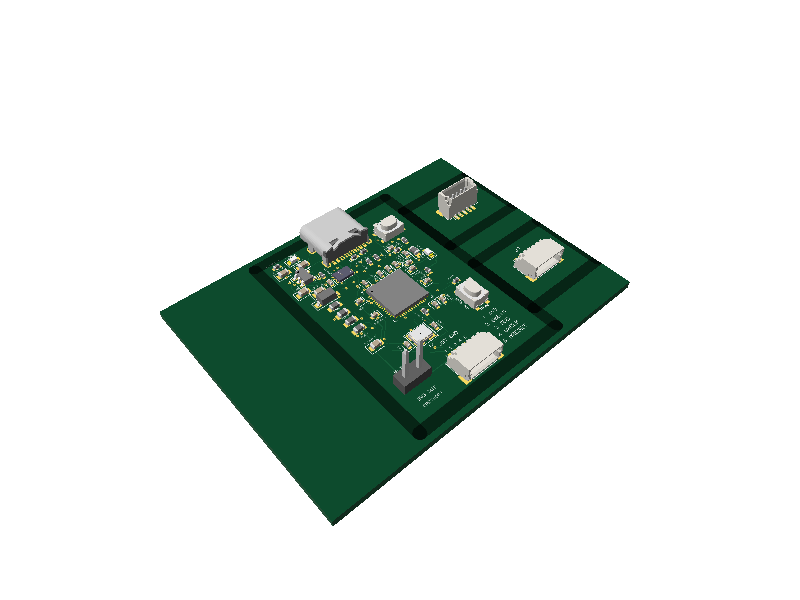
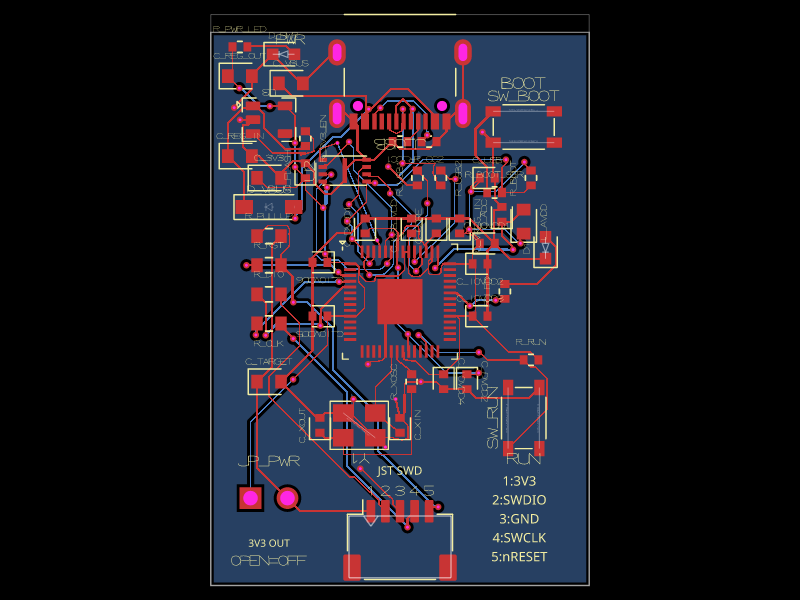
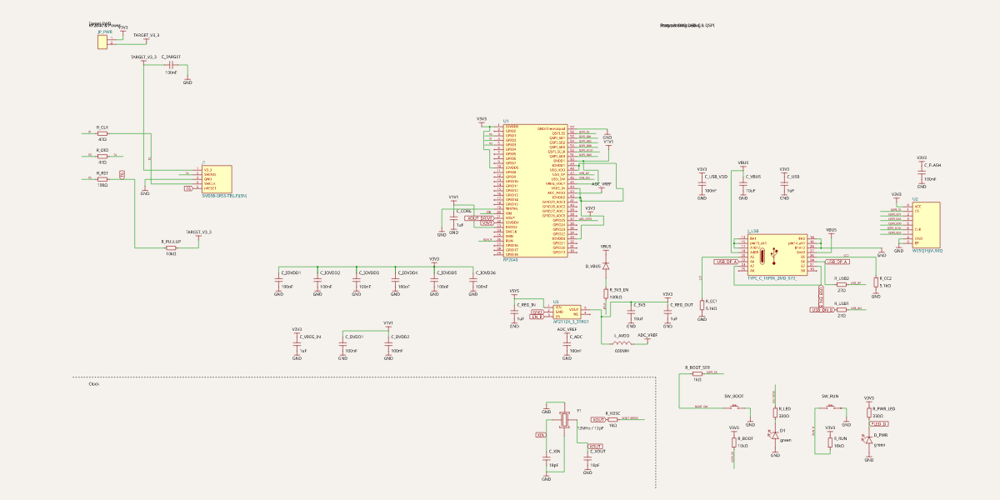

# Standard JST programmer

Five-pin **JST SH, 1.00 mm pitch** SWD interface for **3.3 V targets**, with importable top-entry and side-entry connectors and a USB-C RP2040 programmer.



This repository contains three circuits:

| Circuit | Purpose | Part |
| --- | --- | --- |
| `circuits/upward.circuit.tsx` | Top-entry target connector | JST BM05B-SRSS-TB(LF)(SN), JLCPCB C160391 |
| `circuits/side.circuit.tsx` | Side-entry target connector | JST SM05B-SRSS-TB(LF)(SN), JLCPCB C136657 |
| `circuits/programmer.circuit.tsx` | 26 × 38 mm discrete programmer | RP2040 QFN-56, USB-C, external flash and regulator |

The default preview (`preview.circuit.tsx`, selected by `previewComponentPath` in `tscircuit.config.json`) shows the programmer and both connector boards together. This is a display panel with outline cutouts and no manufacturing tabs; use the three individual circuits for fabrication or import. Placement DRC runs on each individual circuit; the display panel skips placement DRC because the current checker applies the programmer outline to the connector coupons. Routing DRC remains enabled in the panel.

Both connectors include part-specific OBJ and STEP models from the JLCPCB/EasyEDA catalog via tscircuit's model CDN. Their KiCad footprints retain five numbered contacts and two mechanical mounting pads. The vertical model is rotated to match KiCad's pin-1 orientation. The selected manufacturer parts and 1 mm pitch are documented in [JST's SH datasheet](https://www.jst-mfg.com/product/pdf/eng/eSH.pdf).

The programmer uses a **bare RP2040 QFN-56 chip**, a W25Q16JV 2 MiB QSPI flash, an AP2112K 3.3 V regulator, a 12 MHz crystal, and an onboard USB-C connector. All support components, BOOT/RUN buttons and LEDs are on this PCB.

The discrete support circuit is adapted from [tscircuit/common's Microcontroller_RP2040](https://github.com/tscircuit/common/blob/a5797da88ec19944442d87392174af0a36fe1a0a/lib/Microcontroller_RP2040/Microcontroller_RP2040.circuit.tsx). The attributed source and part footprints are kept in `rp2040/` so the programmer can relocate decoupling, add regulator/core bypass capacitors, insert BOOTSEL/crystal series resistors, and explicitly route the crystal connections on the top layer. A bottom-layer GND pour provides additional return copper.

## Pinout

| JST contact | Signal | Function |
| --- | --- | --- |
| 1 | `V3_3` | Target's 3.3 V rail; optional programmer power through JP_PWR |
| 2 | `SWDIO` | Bidirectional SWD data |
| 3 | `GND` | Common ground |
| 4 | `SWCLK` | SWD clock |
| 5 | `nRESET` / `nReset` | Active-low target reset |

This is a **project convention**, not a universal JST SWD standard. Signal order follows the retained signals of the ARM 10-pin Cortex Debug connector (1, 2, 3, 4, 10). No SWO or UART is exposed.

Use two **SHR-05V-S** housings and **SSH-003T-P0.2-H** contacts, or a compatible five-way SH cable. Wire **1→1, 2→2, 3→3, 4→4, 5→5**. Verify contact numbers with a continuity meter: cable wire colors and connector appearance do not establish pin numbering. Both board connector orientations use the same contact numbering; do not mirror the pinout when switching between them. The footprint includes the manufacturer's pin-1 mark.

## Import onto your target board

```sh
tsci add tscircuit/standard-jst-programmer
```

```tsx
import { StandardJstSwdUpward, StandardJstSwdSide } from "@tsci/tscircuit.standard-jst-programmer"

export default () => (
  <board width={30} height={20}>
    <StandardJstSwdUpward name="J_DEBUG" pcbX={0} pcbY={5} />
    <trace from=".J_DEBUG > .V3_3" to="net.V3_3" />
    <trace from=".J_DEBUG > .GND" to="net.GND" />
    <trace from=".J_DEBUG > .SWDIO" to="net.SWDIO" />
    <trace from=".J_DEBUG > .SWCLK" to="net.SWCLK" />
    <trace from=".J_DEBUG > .nRESET" to="net.nRESET" />
    {/* Connect these nets to your MCU's SWD and reset pins. */}
  </board>
)
```

Replace `StandardJstSwdUpward` with `StandardJstSwdSide` for side entry. Components accept normal placement and connection props and do not automatically connect global nets. The side-entry footprint faces -Y at 0°; rotate 90° to face +X. The default package export is `StandardJstSwdUpward`; `ProgrammerBoard` is also a named export.

## Programmer hardware and power

| RP2040 GPIO | Path | JST signal |
| --- | --- | --- |
| GP2 | 47 Ω series resistor | SWCLK |
| GP3 | 47 Ω series resistor | SWDIO |
| GP1 | 100 Ω series resistor, firmware open-drain behavior | nRESET |

Reset has a 10 kΩ pull-up to the **target** rail. The target rail has a 100 nF bypass capacitor. There is no level shifting, voltage sensing, automatic target-power detection, current limiting, or reverse-power protection. This version is for **3.3 V targets only**, not 1.8 V or 5 V.

- **Default: JP_PWR open (no shunt).** Power the target separately at 3.3 V. Pin 1 provides its rail to the reset pull-up; it is not measured by firmware.
- **Optional: JP_PWR closed.** The onboard regulator's 3.3 V rail powers the target. Disconnect the target's other power sources before fitting the shunt. Use only small target loads; a conservative initial budget is 50 mA, subject to regulator temperature and hardware validation. This is an operating limit, not an enforced current limit.
- Power both programmer and target before starting SWD. Do not leave an active probe driving an unpowered target or a powered target connected to an unpowered probe.
- Use a short cable (start at ≤100 mm) and a 1 MHz SWD clock. Increase speed only after verifying reliable operation.

The programmer is **26 × 38 mm**, about **69% less PCB area** than the previous 46 × 70 mm layout. All components mount on the **top side**; two copper layers are used for routing and ground return. USB-C access is at the top edge and JST cable access is at the opposite, bottom edge. The JST contacts are numbered on top silkscreen, with a nearby legend: **1:3V3, 2:SWDIO, 3:GND, 4:SWCLK, 5:nRESET**. Install JP_PWR as a two-pin header and leave the shunt off by default. Assembly includes fine-pitch QFN/WSON devices and 0402 passives. The layout uses 0.1 mm traces in dense areas; verify the fabrication stackup and the USB connector's mechanical requirements before fabrication.

There are no test points. Use the USB BOOTSEL button for firmware loading and recovery. SW_RUN resets the programmer; JST nRESET resets the target.

## Firmware and debugging

`firmware/standard_jst_programmer.h` is the dedicated Pico SDK board definition: RP2040, 12 MHz crystal, 2 MiB Winbond flash, conservative flash clock divider, and GP25 LED. No development-module board definition is used.

`firmware/build.sh` builds Raspberry Pi **debugprobe (CMSIS-DAP)** at pinned commit `3fff5b240ca8200c7ad538cb61c02dfc39bda831` with Pico SDK commit `079c6f39023649b154152db30f1d781e884879bc` (includes the required `pico_usb_reset` API). Its custom board configuration enables GP2/GP3 SWD and GP1 open-drain reset, leaves the upstream CDC UART on unconnected GP4/GP5 (no UART in the cable), drives the status LED on GP25, and disables the reset internal pull-up because the PCB provides a target-referenced pull-up.

Dependencies: Git, Python 3, CMake, an Arm GNU bare-metal toolchain (`arm-none-eabi-gcc`), and newlib including C++ support.

```sh
bash firmware/build.sh
# Result: dist/firmware/standard-jst-programmer.uf2
```

GitHub Actions builds the same UF2 and provides it as the `standard-jst-programmer-uf2` artifact. Do not use the stock Debug Probe UF2: its board pin configuration differs. Hold SW_BOOT while connecting USB (or hold SW_BOOT and tap SW_RUN), then copy the custom UF2 to the RPI-RP2 drive.

For an RP2040 target:

```sh
openocd -f firmware/openocd.cfg -f target/rp2040.cfg
# In another terminal:
arm-none-eabi-gdb firmware.elf
# At the GDB prompt:
# target extended-remote localhost:3333
# monitor reset halt
# load
# continue
```

Use the appropriate OpenOCD target configuration for other MCUs. Connect pin 5 to the target's reset input (RP2040 RUN). The provided OpenOCD adapter config requests connect-under-reset; the target must expose a compatible reset signal.

## Development and validation

```sh
bun install --frozen-lockfile
bun run typecheck
bun run build -- --all-images --svgs
bun run test
bun run dev
```

The checks verify the 26 × 38 mm outline, top-side-only assembly, opposite connector edges, absence of test points, readable JST pinout text, both connector pad/pin mappings, exactly five signal pins plus two mechanical mounting tabs, programmer SWD/reset connectivity, ground continuity, open-jumper power isolation, bare RP2040 supply separation, all six QSPI connections, both USB-C data orientations, CC pull-downs, BOOTSEL series resistance, and absence of build/DRC error records. The routed board and generated schematic are inspected visually. CI separately compiles the custom firmware.

**Prototype status:** generated routing and software checks do not replace assembled hardware testing. No board has been manufactured or electrically tested for this revision. The imported chip footprints lack complete electrical pin metadata, so ERC cannot prove the whole electrical design. Validate USB signal integrity, the oscillator, power budget, connector mechanical fit, and cable continuity before ordering a batch.

## Previews





## Sources

- [JST SH datasheet](https://www.jst-mfg.com/product/pdf/eng/eSH.pdf)
- [tscircuit/common RP2040 source](https://github.com/tscircuit/common/tree/a5797da88ec19944442d87392174af0a36fe1a0a/lib/Microcontroller_RP2040)
- [Raspberry Pi RP2040 hardware design guide](https://datasheets.raspberrypi.com/rp2040/hardware-design-with-rp2040.pdf)
- [Raspberry Pi debugprobe firmware](https://github.com/raspberrypi/debugprobe)
- [KiCad JST footprints](https://github.com/KiCad/kicad-footprints/tree/master/Connector_JST.pretty)

See [THIRD_PARTY.md](THIRD_PARTY.md) for footprint attribution.
